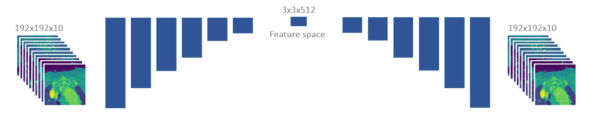

# AutoEncoderHeartCT
An auto-encoder for the heart 2.5-D CT images 

Autoencoders are deep machine learning models that can be used as a dimension reduction technique to condense a large amount of information into a small feature space for classification purposes. In this repository, you can find a trained model as well as the code to train a model from scratch to make an autoencoder that reconstructs 2.5-dimensional data. The data is obtained from the COVID-19 patient's heart via 3-D X-ray computed tomography. Each of the input images includes 10 equally-distanced slices from the base to the apex of the heart. 

Training and test data are stored and read via HDF5 format stored in a field named 'X' with 8-bit unsigned integers between 0 and 255. 
The model structure is fully convolutional with same-size padding, and a filter size of 3x3. There are 6 encoding and decoding steps in the model and the depth of the filters starts from 10 and increases to 512 in feature space. 

An example reconstruction of an image as well as the ground truth are visualized for 10 different short-axis slices of the heart. 

This is the list of the required python packages to run the codes: 
* NumPy
* TensorFlow
* h5py
* matplotlib

To train a model from scratch, run 'Train.py' file and change the value of the variable 'TrainFromScratch' to True. If you just to train with more data change it to False and add your additional data to 'TrainData.h5'. 
If you want the model to save the trained model, change 'AutoSaveModel' to True. 
To predict using the already trained model, run 'Predict.py'. It will read from 'TestData.h5' and plot the reconstruction results. 

Note: Datasets have been truncated to save the storage size. It is recommended to use at least 700 to 1000 sets of sliced images if you want to train from scratch. 

